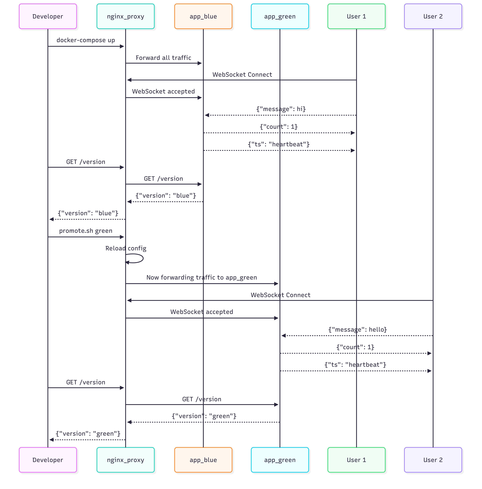

# SigIQ WebSocket Service – Production-Ready Backend (WIP)

This project focuses on implementing a production-ready WebSocket service using Django, Channels, and Docker.

You can reference this image in your markdown as follows:



---

## Tech Stack

- **Django** 4.2
- **Django Channels** 4.x
- **Uvicorn** (ASGI server)
- **Python** 3.11
- **Docker** & **Docker Compose**

---

## How to Run (Development)

1. **Clone the repository**
    ```bash
    git clone <your-repo-url>
    cd sigiq_ws_project
    ```

2. **Build & run with Docker**
    ```bash
    cd docker
    docker compose -f compose.yml up --build
    ```

3. **Access in browser**  
   [http://localhost:8000](http://localhost:8000)

4. **WebSocket endpoint**  
   ```
   /ws/chat/
   ```
   
5. **Heartbeat Broadcast**: Every 30 seconds, the server broadcasts a timestamp message to all active WebSocket clients:
   ```
   {"ts": "2025-07-28T12:34:56.000Z"}
   ```

6. **Ngnix Proxy**: (default : blue)
   ```bash
   docker exec nginx_proxy promote.sh green/blue 
   ```

---

## Service Endpoints

The application exposes two lightweight HTTP endpoints for monitoring and validation of the currently promoted environment.

1. /version/: Returns the currently active deployment color (e.g., blue or green).
    - URL: http://localhost:8000/version/
	- Method: GET
	- Response:
        ```json
        {
            "version": "blue"
        }
        ```
    - This value is set using the APP_VERSION environment variable (set in docker-compose.yml).

----

2. /healthz/: Basic health check endpoint for container orchestration systems (e.g., Docker, Kubernetes).
	- URL: http://localhost:8000/healthz/
	- Method: GET
	- Response:
        ```json
        {
            "status": "ok"
        }
        ```
---

## Testing the WebSocket

### Method 1: Using wscat (CLI)

1. **Install wscat (if not already)**
    ```bash
    npm install -g wscat
    ```

2. **Connect to the WebSocket server**
    ```bash
    wscat -c ws://localhost:8000/ws/chat/
    ```

3. **Send messages**
    ```
    > hello
    < {"count": 1}
    > test
    < {"count": 2}
    ```

4. **Disconnect**  
   Press <kbd>Ctrl</kbd>+<kbd>C</kbd>.

---

### Method 2: Using Browser Developer Tools

1. Open Chrome and press <kbd>F12</kbd> to open DevTools.

2. Go to the **Console** tab and run:
    ```javascript
    const ws = new WebSocket("ws://localhost:8000/ws/chat/");
    ws.onmessage = (e) => console.log("Message:", e.data);
    ws.onopen = () => {
      ws.send("first");
      ws.send("second");
    };
    ```

3. **Expected output:**
    ```
    Message: {"count": 1}
    Message: {"count": 2}
    ```

4. **Close the connection:**
    ```javascript
    ws.close(1000, "closing");
    ```

## Smoke Test
1. Run `pytest tests` from app/ folder.